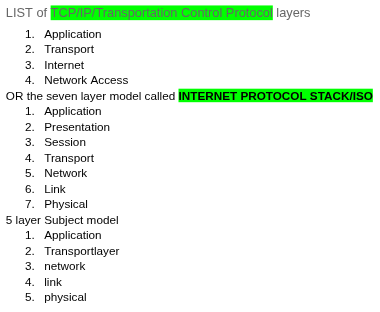

Computer Network exam prep

I. Plan

* [X] Finalize subject notes perp
* [X] recap themes and topics involved
* [ ] review all books OR revised notes
* [ ] Finish review sample questions
* [ ] [optional] work on medium article

Exam first date = 19 January 2026

List of Internet Protocol layers, core of computer network

Medium article proposal = TCP vs UDP, comparing the two

II. Course structure

* Chapter one -- introduction
  * whats internet and protocol
  * network edge
  * network core
  * performance = loss, delay, throughput
  * protocol layers, service models
  * security
  * history* (unnecessary topic)
* Chapter one part B -- introduction
  * ISO/OSI reference model
  * Transmission modes
  * Line configuration
  * unicast, broadcast, multicast
  * Topology
  * Area network types
  * IOT - networking trend*
* Chapter two -- application layer (first layer)
  * Principles of network applications
  * web and HTTP
  * email, SMTP, IMAP
  * Domain name system (DNS)
  * Video streaming and content distribution network (**CDN)**
  * Socket programming with UDP and TCP
* Chapter three -- Transport layer (second layer) -- software heavy
  * Transport layer services
  * multiplexing and demultiplexing
  * Connectionless transport -- UDP
  * Principles of reliable data transfer
  * Connection-oriented transport -- TCP
  * principles of congestion control
  * TCP congestion control
  * Evolution of transport-layer functionality
* Chapter four -- Network layer (third layer) -- soft/hardware hybrid
  * Layer overview - services and protocols
    * Data plane
    * Control plane
  * Inside a router
    * input/output ports, switching
    * buffer management
    * scheduling
  * IP - internet protocol
    * Datagram format, addressing
    * Network address translation (NAT)
    * IPv6 (difference with IPv4)
  * Generalized Forwarding
    * match+action
    * openflow
    * middleboxes
  * Internet architecture
* Chapter four part B -- Internet protocol specific
  * IPv4, IPv6,
  * Reserved address
  * Address classes
  * Subnet mask
  * Boolean algebra for IP address
* Chapter five -- network layer control plane -- router to router communication
  * introdudction
  * routing protocols
    * link state
    * distance vector
  * intra-ISP routing: OSPF
  * Routing among ISPs : BGP
  * SDN control plane
  * Internet control message protocol
  * Network management, config
    * SNMP and Netconf/YANG
* Chapter six -- Link layer and LAN
  * introduction
  * error detection and correction
  * multiple access protocols
  * LAN (Local area network)
    * addressing
    * ethernet
    * switches
    * VLAN
  * link virtualization: MPLS
  * Data center networking
  * web request recap
